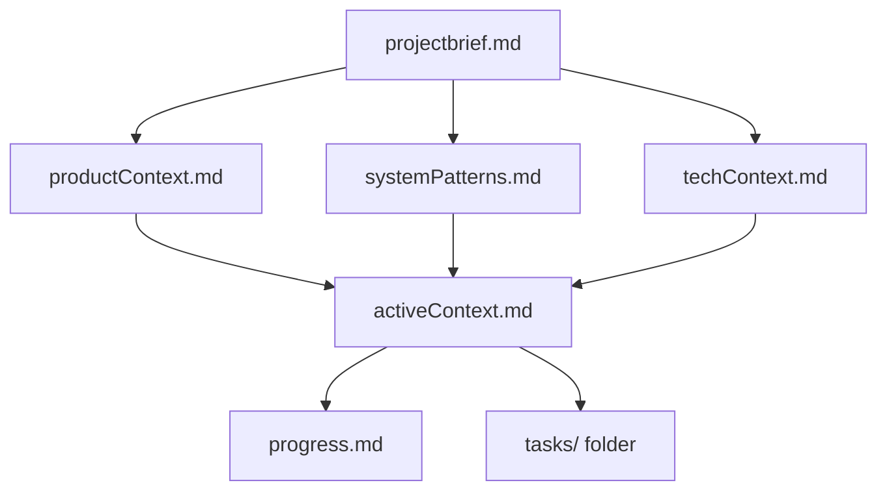

# Memory Bank Structure Guide

## Generic Standard (Most Projects)

Used for standalone projects or when not in `/ofertasdachina` repos.

### Core Files
1. `projectbrief.md` - Foundation, requirements, goals
2. `productContext.md` - Why project exists, problems solved, UX goals
3. `activeContext.md` - Current work focus, recent changes, next steps
4. `systemPatterns.md` - Architecture, technical decisions, design patterns
5. `techContext.md` - Technologies, setup, constraints, dependencies
6. `progress.md` - What works, what's left, current status, issues

### Folders
- `tasks/` - Individual task files (`TASKID-taskname.md`) + `_index.md`
- `audits/` - Audit reports (`AUDIT-YYYY-MM-DD.md`)
- `notes/` - Non-task docs (`DDMMYYYY-description.md`)

### Hierarchy


## Ofertasdachina Custom (Project-Specific)

Used when working in `/ofertasdachina` repos (matches distributed microservices context).

### Structure
```
memory-bank-{service}/
├── 00-overview.md           # What? Why? Start here
├── 01-architecture.md       # Design, components, flows
├── 02-components.md         # Modules, classes, functions
├── 03-process.md            # Workflows, algorithms
├── 04-active-context.md     # Current state, decisions
├── 05-progress-log.md       # Complete history of changes
├── 06-deployment.md         # Deploy, rollback, troubleshooting
└── 07-reference.md          # Links, external resources
```

### When to Update
- Architectural changes → `01-architecture.md`
- New features/components → `02-components.md`
- Current work → `04-active-context.md`
- After completing tasks → `05-progress-log.md`

## Decision Tree

```
Working in /ofertasdachina repos?
├─ YES → Use Ofertasdachina Custom
└─ NO → Use Generic Standard
```

## Tasks Integration

Both structures support tasks via:
- Generic: `tasks/_index.md` + `TASKID-taskname.md`
- Ofertasdachina: Integrated in `04-active-context.md` and `05-progress-log.md`

## Migration Notes

When converting between structures:
- Generic `activeContext.md` → Custom `04-active-context.md`
- Generic `progress.md` → Custom `05-progress-log.md`
- Generic `systemPatterns.md` → Custom `01-architecture.md`
- Tasks remain compatible